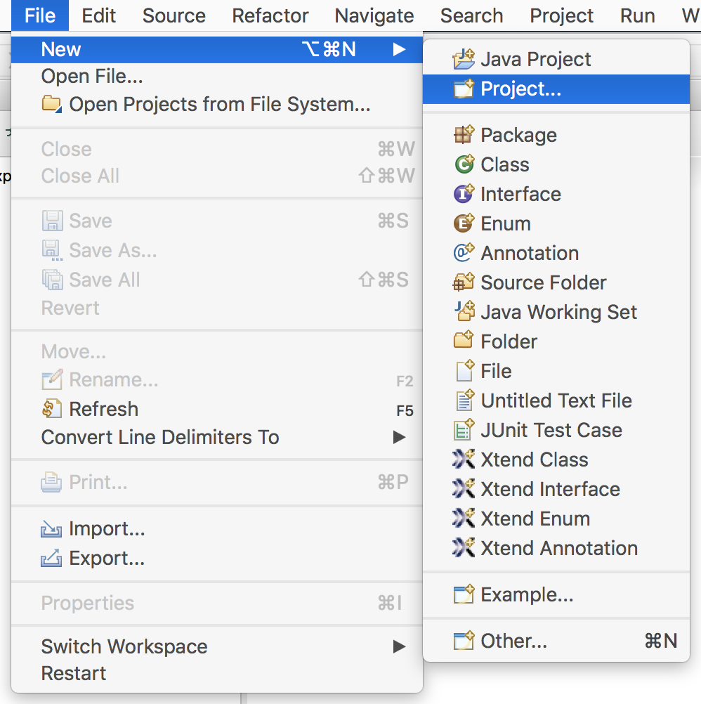
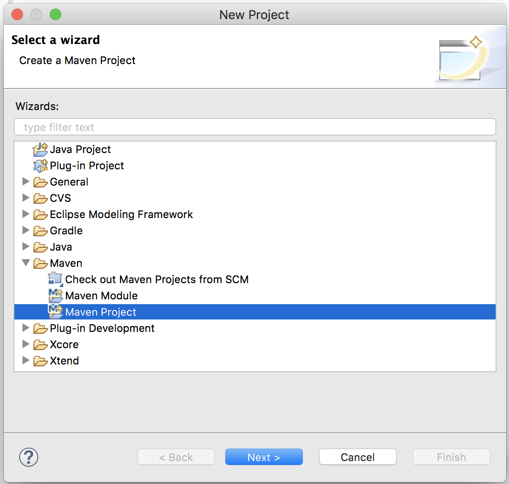
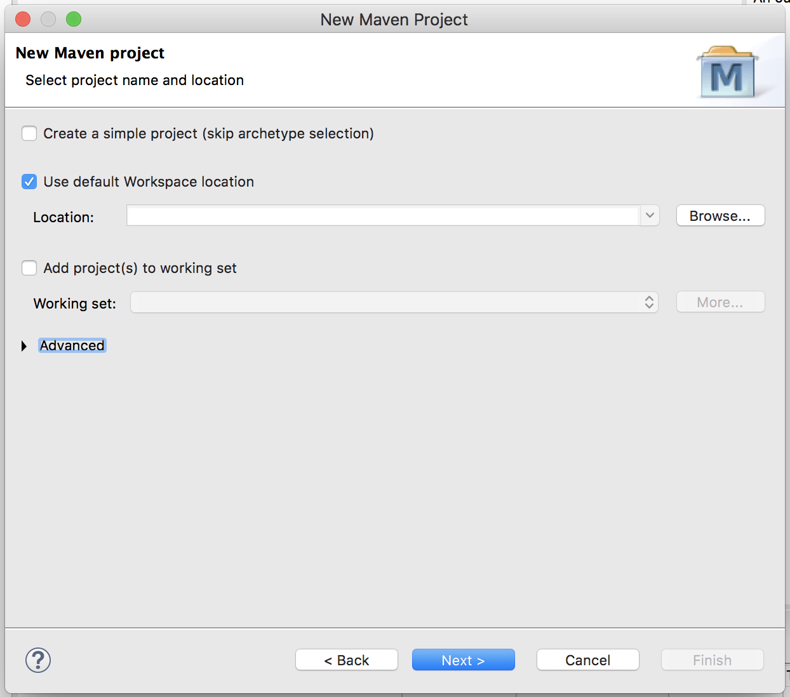
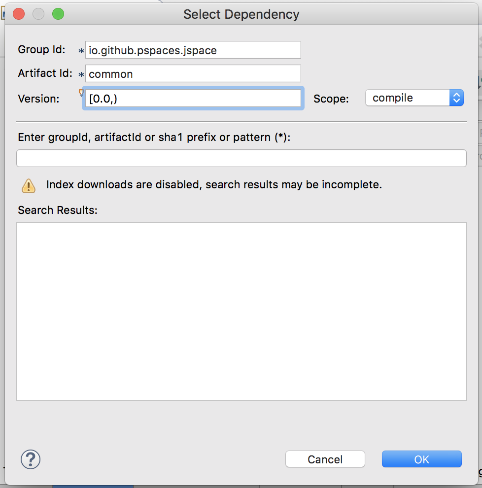
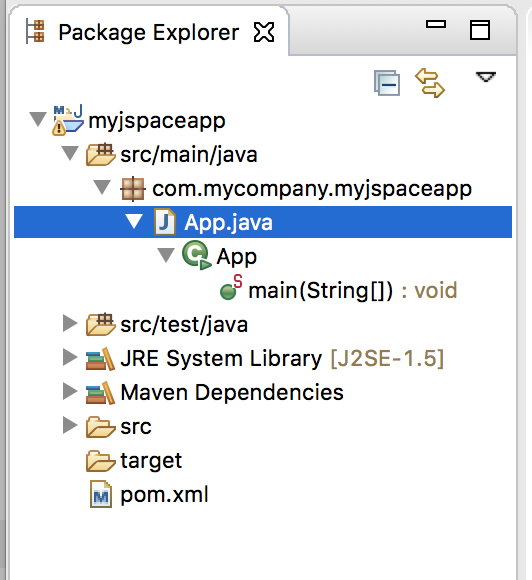

# Your first jSpace applications (with Eclipse)
If you have successfully [built and installed](getting_started.md) you can use Eclipse to develop your first jSpace Application. In fact you will use Eclipse as an IDE and Maven to manage dependencies. 

Open Eclipse and select "File -> New -> Project" menu:













```
mvn -B archetype:generate \
  -DarchetypeGroupId=org.apache.maven.archetypes \
  -DgroupId=com.mycompany.myjspaceapp \
  -DartifactId=myjspaceapp
```

The command above generates the skeleton of a Maven project in a folder named ```myjspaceapp```. In particular, inside folder ```src``` you can find the two directories ```main/java``` and ```test/java``` where basic Java files for the app and its tests, respectively.

Maven also generates the ```pom.xml``` (in directory ```myjspaceapp```) describing how building your code and all the needed dependencies. Open this file with your preferred editor and declare the dependency to jSpace. In the generated ```pom.xml``` file you should find something of the form:

```
<dependencies>
  <dependency>
    <groupId>junit</groupId>
    <artifactId>junit</artifactId>
    <version>3.8.1</version>
    <scope>test</scope>
  </dependency>
</dependencies>
```

you have to add above the reference to jSpace:

```
<dependencies>
  <dependency>
    <groupId>junit</groupId>
    <artifactId>junit</artifactId>
    <version>3.8.1</version>
    <scope>test</scope>
  </dependency>
  <dependency>
    <groupId>io.github.pspaces.jspace</groupId>
    <artifactId>common</artifactId>
    <version>[0.0,)</version>
  </dependency>
</dependencies>
```

At this point you can change the generated Java code to implement the desired application. In this short guide we simply open:

```
myjspaceapp/src/main/java/com/mycompany/myjspaceapp/App.java
```

Add the following code:

```
package com.mycompany.myjspaceapp;

import org.jspace.FormalField;
import org.jspace.SequentialSpace;
import org.jspace.Space;

public class App {

	public static void main(String[] argv) throws InterruptedException {
		Space inbox = new SequentialSpace();

		inbox.put("Hello World!");
		Object[] tuple = inbox.get(new FormalField(String.class));				
		System.out.println(tuple[0]);

	}

}
```

To build and test your application with Maven the following command can be executed in the directory ```myjspaceapp```:

```
mvn clean verify
```

Generated files are stored in the directory ```myjspaceapp/target```. In particular, you can find the file ```myjspaceapp-1.0-SNAPSHOT.jar``` providing an access to the binaries of your application.

To run your app you need also to provide a reference to all the required packages. These are located in your local Maven repository and it may be not convenient to explicitly refer to them.

You can modify file ```pom.xml``` to let Maven generate a jar files where all the required classes are included.

Open file ```myjspaceapp/pom.xml``` and add the following code just before the closing tag ```</project>```:

```
<build>
    <plugins>
        <plugin>
            <artifactId>maven-assembly-plugin</artifactId>
            <configuration>
                <archive>
                    <manifest>
                        <addClasspath>true</addClasspath>
                    </manifest>
                </archive>
                <descriptorRefs>
                    <descriptorRef>jar-with-dependencies</descriptorRef>
                </descriptorRefs>
            </configuration>
              <executions>
                  <execution>
                      <id>make-my-jar-with-dependencies</id>
                      <phase>package</phase>
                      <goals>
                          <goal>single</goal>
                      </goals>
                  </execution>
              </executions>
        </plugin>
    </plugins>
</build>
```

At this point you can re-build and test your application by executing the following command in the directory ```myjspaceapp```:

```
mvn clean verify
```

A new file named ```myjspaceapp-1.0-SNAPSHOT-jar-with-dependencies.jar``` has been generated in the directory ```target```. Differently from the one previously considered above, this file contains all the dependencies and can be used to execute our application. You have just to enter inside directory ```target``` and execute:

```
java -cp myjspaceapp-1.0-SNAPSHOT-jar-with-dependencies.jar com.mycompany.myjspaceapp.App
```

Note that if your applications consists of multiple programs, you have only to change the name of main class to use.

It is sometime useful to generate a jar file that can be directly executed. This is possible by including in the jar a ```MANIFEST``` file. Maven can do this work for you. You have only to change the build instructions considered above. In particular you have to modify the content of tag ```configuration``` as follow:

```
<configuration>
    <archive>
        <manifest>
            <addClasspath>true</addClasspath>
            <mainClass>com.mycompany.myjspaceapp.App</mainClass>
        </manifest>
    </archive>
    <descriptorRefs>
        <descriptorRef>jar-with-dependencies</descriptorRef>
    </descriptorRefs>
</configuration>
```

You may notice that a new declaration is now included to say that the ```mainClass``` is ```com.mycompany.myjspaceapp.App```. Re-build your application by executing again ```mvn clean verify``` in the directory ```myjspaceapp```.

File ```myjspaceapp-1.0-SNAPSHOT-jar-with-dependencies.jar``` now contains a ```MANIFEST``` where class ```com.mycompany.myjspaceapp.App``` is used as entry point of the execution. You can now execute your app by simply executing  in the directory ```myjspaceapp/target``` the following command:

```
java -jar myjspaceapp-1.0-SNAPSHOT-jar-with-dependencies.jar
```
